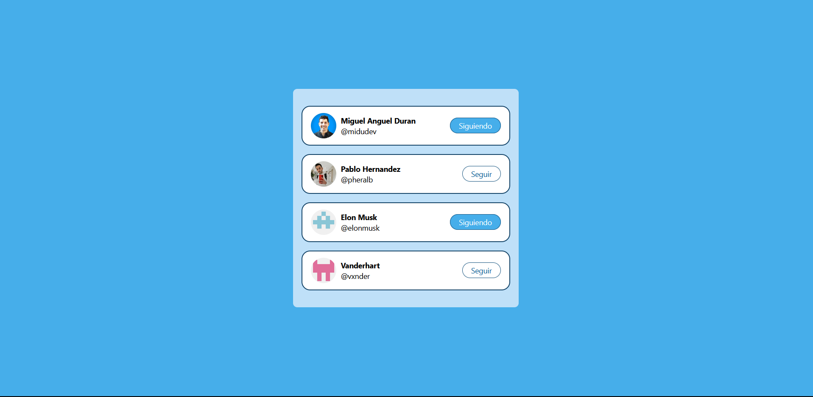

# Twitter-Follow-card - #miduChallenges

This project is a minimalist Twitter follow card component for displaying blog or article information. It leverages technologies such as React and Tailwind CSS to craft a clean and elegant user interface tailored for social media engagement.

## Technologies Used

- HTML
- CSS
- JavaScript
- React.js
- Tailwind CSS

## Demo

You can see a demonstration of the application in action [Twitter-Follow-Card](https://ibrahim-003.github.io/minimal-blog-card/)

## Capturas de Pantalla

